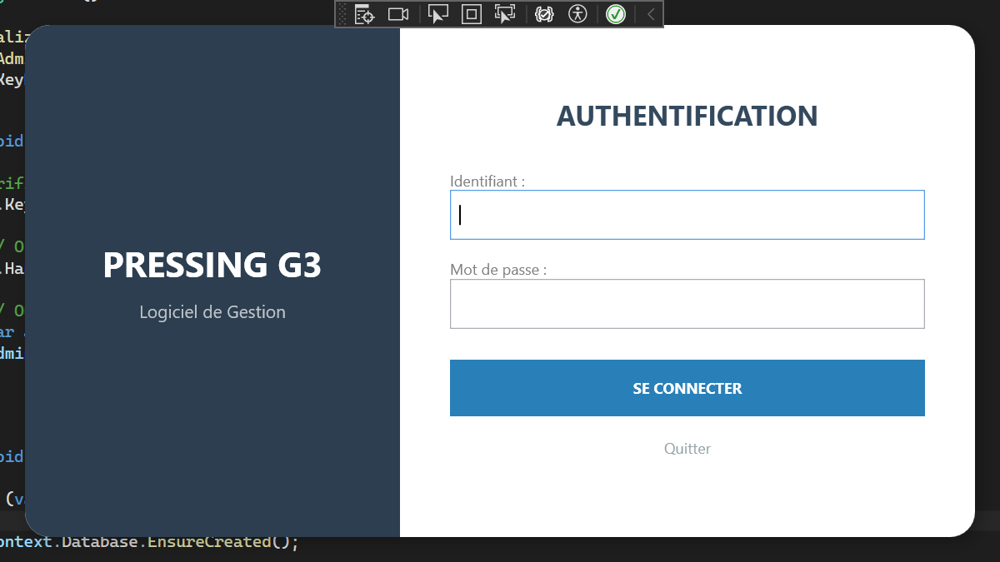
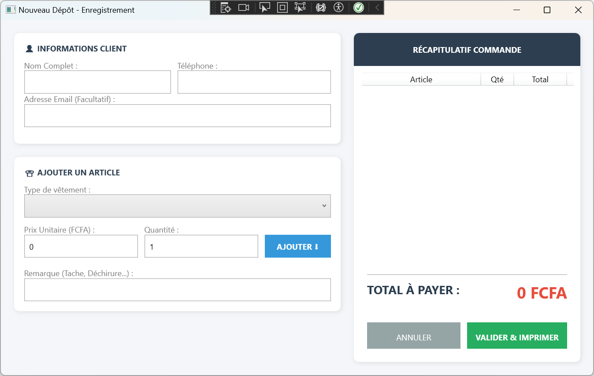
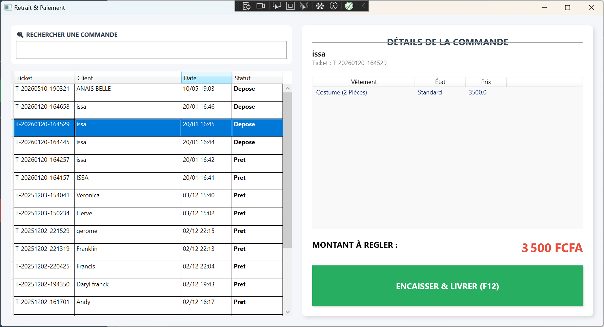
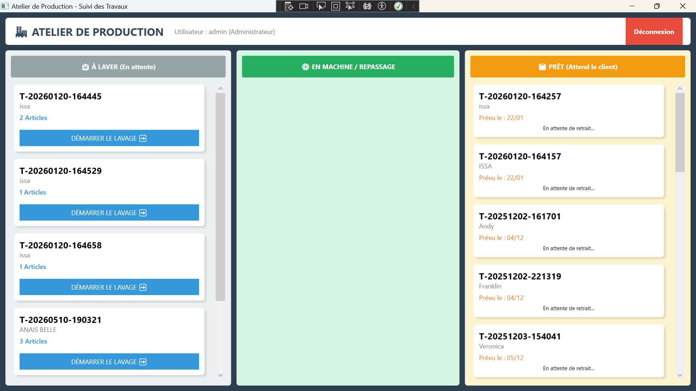
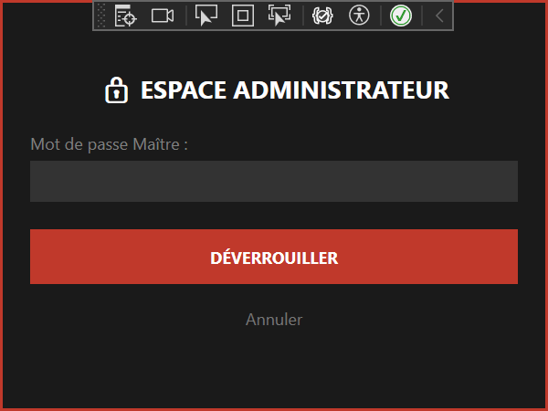
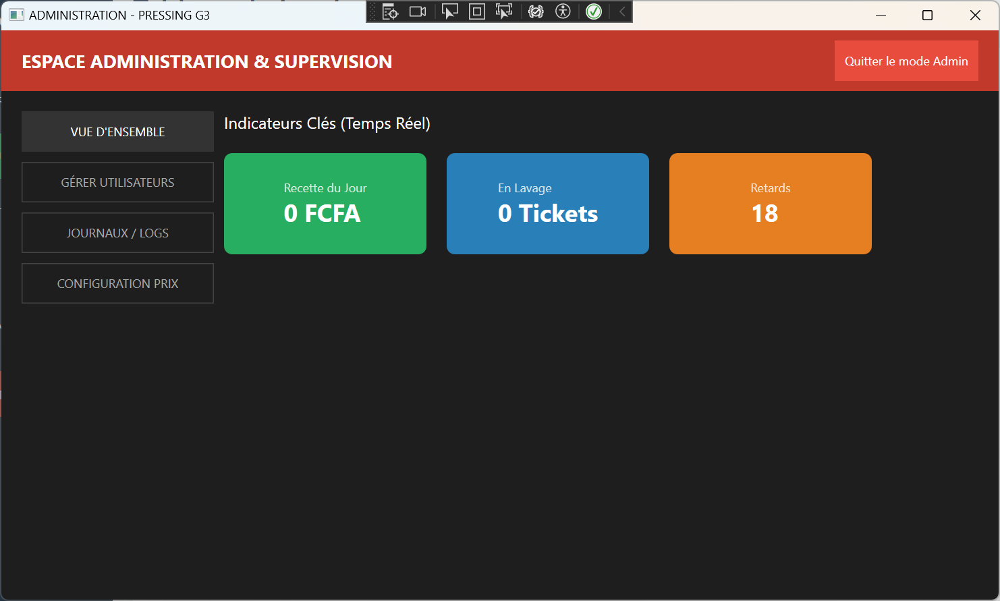

# Application Lourde C# - Projet G3 

Cette application de bureau a été développée en C# avec une interface graphique WPF (Windows Presentation Foundation) dans le cadre d'un projet académique en équipe.

##  Présentation & Architecture

**PressingG3** est une application lourde de gestion de pressing développée en équipe. Ce projet met en avant des pratiques de développement modernes et une séparation stricte des responsabilités afin de garantir la maintenabilité et l'évolutivité du code.

### Points clés de l'architecture :
* **Pattern MVVM (Model-View-ViewModel) :** Séparation complète entre la logique métier et l'interface utilisateur. Les dossiers `Views` et `ViewModels` au sein de `PressingG3.UI` illustrent cette implémentation, facilitant le découplage et les tests.
* **Architecture multicouche :** Découpage du projet en deux entités distinctes :
  * `PressingG3.core` : Contient la logique métier, les entités, les interfaces, les migrations et les services de gestion de données.
  * `PressingG3.UI` : Gère uniquement l'affichage graphique (XAML/WPF) et l'interaction utilisateur.

### Fonctionnalités techniques majeures :
* **Authentification sécurisée :** Gestion des rôles utilisateurs (par exemple, création automatique d'un compte `admin` par défaut si la base est vide).
* **Persistance et ORM :** Utilisation d'**Entity Framework Core (EF Core)** pour faire le pont entre les objets C# et la base de données via un `DbContext`.
* **Génération automatique de base de données :** Utilisation de `context.Database.EnsureCreated()` pour initialiser automatiquement la structure de données au premier lancement.

##  Technologies utilisées
* **Langage :** C#
* **Framework Graphique :** .NET / WPF (Windows Presentation Foundation)
* **Accès aux données (ORM) :** Entity Framework Core
* **Patron d'architecture :** MVVM
* **IDE recommandé :** Visual Studio

##  Comment exécuter le projet
1. Cloner le dépôt.
2. Ouvrir le fichier `.sln` (Solution) avec Visual Studio.
3. Restaurer les packages NuGet si nécessaire.
4. Cliquer sur **Démarrer** (ou Run) pour lancer l'application.

## Ajout de capture d'ecran de l'application

